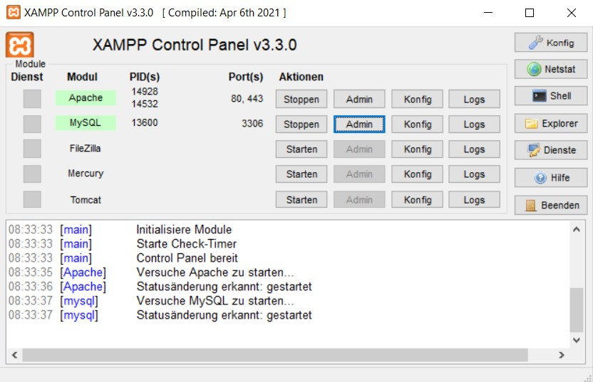
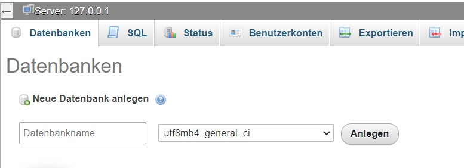
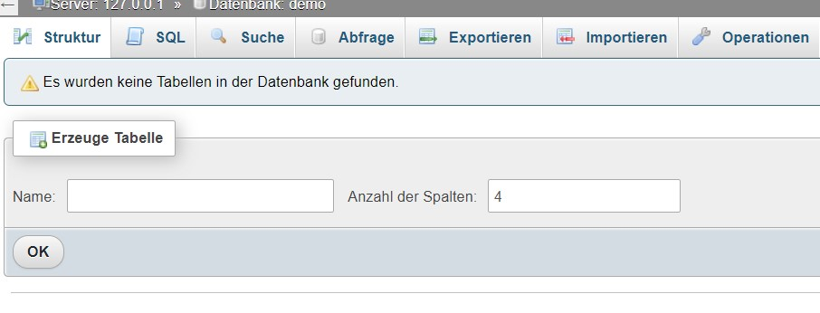
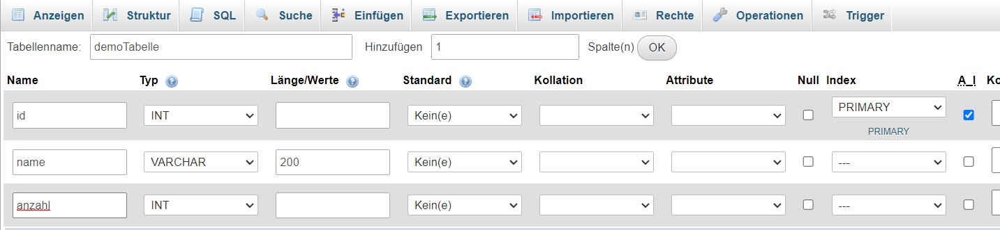
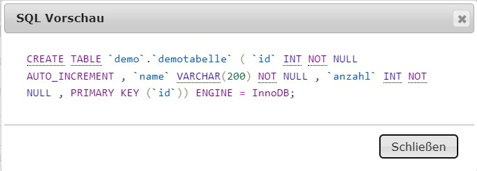

# FSE_Landerer_JDBC Dokumentation

Du musst neue Konzepte verstehen und erklären können und diese selbst dokumentieren
(Markdown), dazu zählen:
o MySQL-Datenbankserver einreichten
o DB-Server Adminkonsole einreichten und verwenden können (insb. auch SQL-Statements
absetzen können)
o Java-Maven-Projekt erstellen
o Dependency für die Verbindung einer MySQL-Datenbank in der pom.xml hinzufügen
o Verbindung zur Datenbank aufbauen
o Prepared-Statement für die Abfrage von Daten aus der DB verwenden
o Prepared-Statement für die Änderung von Daten in der DB verwenden
o Abgefragte Daten aus der DB mit ResultSet und Schleifen verarbeiten
o Exceptions verwenden und verarbeiten, die auftreten können
o Debugging von JDBC-Applikationen (SQL-Statements prüfen, Exceptions richtig interpretieren,
Debugger verwenden)

## MySQL-Datenbankserver einrichten

Um auf dem eigenen PC mit einem Datenbankserver arbeiten zu können, wird in der Praxis XAMPP oder Docker verwendet. Da wir im letzten Jahr bereits mit XAMPP gearbeitet haben und dies bereits eingerichtet und konfiguriert ist, wird dies auch nun genutzt. 

Ist der Dienst Apache und MySQL gestartet, kann der lokale Rechner auf den Webserver und den SQL Server zugreifen.

## DB-Server Adminkonsole einreichten und verwenden

Auf phMyAdmin können nun die Datenbanken des eigenen Servers verwaltet werden. Eine neue Datenbank kann entweder über ein SQL Statement oder über die GUI erstellt werden. 

Ist die neue Datenbank erstellt, so ist diese zunächst leer und muss mit Tabellen befüllt werden. Dies kann wieder mit einem SQL-Befehl oder über die GUI geschehen.

Dabei muss unter anderem der Tabellenname sowie die Spaltennamen und deren Typen angegeben werden. 

Um Datenbanken mit Java zu verwalten und aktualisieren, müssen SQL Statements verwendet werden. 

