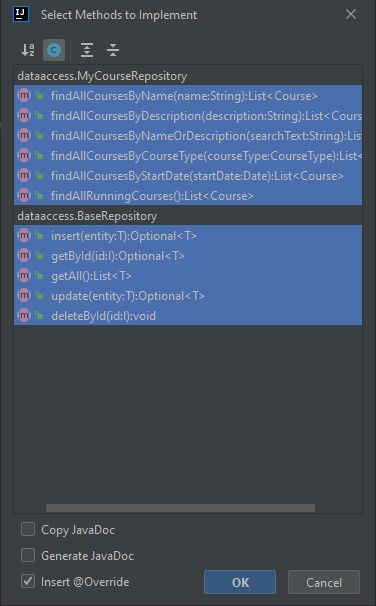

# JDBC INTRO

## MySQL-Datenbankserver einrichten

Um auf dem eigenen PC mit einem Datenbankserver arbeiten zu können, wird in der Praxis XAMPP oder Docker verwendet. Da wir im letzten Jahr bereits mit XAMPP gearbeitet haben und dies bereits eingerichtet und konfiguriert ist, wird dies auch nun genutzt. 


Ist der Dienst Apache und MySQL gestartet, kann der lokale Rechner auf den Webserver und den SQL Server zugreifen.

## DB-Server Adminkonsole einreichten und verwenden

Auf phMyAdmin können nun die Datenbanken des eigenen Servers verwaltet werden. Eine neue Datenbank kann entweder über ein SQL Statement oder über die GUI erstellt werden. 


Ist die neue Datenbank erstellt, so ist diese zunächst leer und muss mit Tabellen befüllt werden. Dies kann wieder mit einem SQL-Befehl oder über die GUI geschehen.


Dabei muss unter anderem der Tabellenname sowie die Spaltennamen und deren Typen angegeben werden. 


Um Datenbanken mit Java zu verwalten und aktualisieren, müssen SQL Statements verwendet werden. 


## Java-Maven-Projekt erstellen & Dependency für die Verbindung einer MySQL-Datenbank in der pom.xml hinzufügen

Ein Mavenprojekt kann über IntelliJ ganz einfach erstellt werden. Dabei wird eine pom.xml generiert, die um beliebige Dependencies und Plugins erweitert werden kann.


Die Dependency für die Verbindung mit einer MySQL-Datenbank wurde hier schon eingefügt.

## Verbindung zur Datenbank aufbauen

````java
String connectionUrl = "jdbc:mysql://localhost:3306/jdbcdemo";
        String user = "root";
        String pwd = "";
        try (Connection con = DriverManager.getConnection(connectionUrl, user, pwd)){
            System.out.println("Verbindung zur DB hergestellt!");

        } catch (SQLException e) {
            System.out.println("Fehler beim Aufbau der Verbindung zur DB: \n" + e.getMessage());
        }
````

Möchte man nun mit Java eine Verbindung mit der Datenbank herstellen, muss zunächst ein String mit der URL, die zur gewünschten DB führt, erstellt werden. Arbeitet man mit XAMPP, lautet dieser zumeist "jdbc:mysql://localhost:3306/dbname" - außerdem ist der Username standardmäßig "root" und das Passwort leer.

Den eigentlichen Verbindungsaufbau übernimmt dann der DriverManager - mit diesem Service können JDBC-Driver verwaltet werden. DriverManager.getConnection() übergibt man die zuvor angelegte URL, Username und Passwort - sobald die Verbindung hergestellt ist, speichert der DriverManager diese in ein Connection Objekt. Wurde die Verbindung erfolgreich hergestellt, könnte die DB nun nach ````System.out.println("Verbindung zur DB hergestellt!");```` mit SQL-Statements bearbeitet werden.
Normalerweise müsste die Verbindung mit der DB nach beenden der Aufgabe wieder geschlossen werden - schreibt man aber die Verbindung in den Head des try-Blocks, so kann man auf con.close verzichten, da die Verbindung automatisch geschlossen wird, sobald der try-Block abgearbeitet ist.

## Prepared-Statement für die Abfrage von Daten aus der DB verwenden

````java
String sqlSelectAllPersons = "SELECT * FROM `student`";
try (Connection con = DriverManager.getConnection(connectionUrl, user, pwd)){
            System.out.println("Verbindung zur DB hergestellt!");

            PreparedStatement preparedStatement = con.prepareStatement(sqlSelectAllPersons);
            ResultSet rs =  preparedStatement.executeQuery();
            while(rs.next()) {
                int id = rs.getInt("id");
                String name = rs.getString("name");
                String email = rs.getString("email");
                System.out.println("Student aus der DB: [ID] " + id + " [NAME] " + name + " [EMAIL] " + email);
            }
        } catch (SQLException e) {
            System.out.println("Fehler beim Aufbau der Verbindung zur DB: \n" + e.getMessage());
        }
````
Mit einem SQL-Statement können nun z.B. alle Daten aus der Datenbank geholt und weiter verarbeitet werden. In dem oben angeführten Beispiel werden alle Datensätze aus der Tabelle "student" herausgeholt, jeweils in Variablen gespeichert und anschließend auf der Kommandozeile ausgegeben.


## Prepared-Statement für die Änderung von Daten in der DB verwenden

Da sich Daten mit der Zeit ändern können, können Datensätze im nachhinein verändert werden. Dies wird mit dem SQL-Befehl "UPDATE" umgesetzt.

````java
PreparedStatement preparedStatement = con.prepareStatement(
                    "UPDATE `student` SET `name` = ?, `email` = ? WHERE `student`.`id` = ?");
            //reagiert auf Absetzen des Statements
            try {
                preparedStatement.setString(1, neuerName);
                preparedStatement.setString(2, neueEmail);
                preparedStatement.setInt(3, studentId);
                int affectedRows = preparedStatement.executeUpdate();
                System.out.println("Anzahl der aktualisierten Datensätze: " + affectedRows);
            }catch (SQLException ex) {
                System.out.println("Fehler im SQL-Update Statement: " + ex.getMessage());
            }
````
Der Methode, in der das Update vollzogen wird, werden die neuen Datensätze mitgegeben, welche dann dem SQL-Statement mitgegeben werden. In diesem Beispiel wurde der Datensatz mit der ID 3 verändert, da sich der Name nach eine Hochzeit geändert hat.


## Abgefragte Daten aus der DB mit ResultSet und Schleifen verarbeiten

Möchte man Daten aus einer Datenbank herausholen und dann weiterverarbeiten, so werden diese zunächst in ein ResultSet gespeichert. Dort sind diese wie in einem assoziativem Array gespeichert und können mit dem passenden Getter und dem Key aus diesem herausgeholt werden.

````java
PreparedStatement preparedStatement = con.prepareStatement(sqlSelectAllPersons);
            ResultSet rs =  preparedStatement.executeQuery();
            while(rs.next()) {
                int id = rs.getInt("id");
                String name = rs.getString("name");
                String email = rs.getString("email");
                System.out.println("Student aus der DB: [ID] " + id + " [NAME] " + name + " [EMAIL] " + email);
            }
````

In diesem Fall werden die Inhalte in Variablen gespeichert und anschließend auf der Kommandozeile ausgegeben.


## Exceptions verwenden und verarbeiten, die auftreten können

Eine Exception ist ein Ereignis, das während der Ausführung eines Programms auftritt und den normalen Ablauf der Programmanweisungen stört. Arbeitet man mit einer Datenbank, könnte z.B. eine SQLException auftreten. Um unterscheiden zu können, wann die Exception auftritt, kann diese an verschiedenen Codestellen "gefangen" werden. 

````java
try (Connection con = DriverManager.getConnection(connectionUrl, user, pwd)){
    System.out.println("Verbindung zur DB hergestellt!");
    PreparedStatement preparedStatement = con.prepareStatement(
        "INSERT INTO `kurs` (`id`, `name`, `maxstudents`) VALUES (NULL, ?, ?)");
    try {
        preparedStatement.setString(1, name);
        preparedStatement.setInt(2, maxStudents);
        int rowAffected = preparedStatement.executeUpdate();
        System.out.println(rowAffected + " Datensätze eingefügt");
    } catch (SQLException ex) { //reagiert auf Absetzen des Statements
        System.out.println("Fehler im SQL-INSERT Statement: " + ex.getMessage());
    }

} catch (SQLException e) { //reagiert auf den Verbindungsaufbau zur Datenbank
    System.out.println("Fehler beim Aufbau der Verbindung zur DB: \n" + e.getMessage());
}
````

Hier wird im äußeren try-catch-Block eine SQLException geworfen, wenn die Verbindung zur Datenbank fehlgeschlagen ist - im inneren try-catch-Block wird die SQLException geworfen, wenn das Absetzen des SQL-Statements fehlgeschlagen ist. Man könnte natürlich eigene Exceptions entwerfen, die in speziellen Fällen zum Einsatz kommen.

# JDBC und DAO

## DAO-Pattern zum objektrelationalen Zugriff auf Datenbanken verstehen und anwenden

Das Data Access Object ist ein Entwurfsmuster, das den Zugriff auf unterschiedliche Arten von Datenquellen (z. B. Datenbanken, Dateisystem) so kapselt, dass die angesprochene Datenquelle ausgetauscht werden kann, ohne dass der aufrufende Code geändert werden muss. Dadurch soll die eigentliche Programmlogik von technischen Details der Datenspeicherung befreit werden und flexibler einsetzbar sein. (https://de.wikipedia.org/wiki/Data_Access_Object)


## Grundkonzept des objektrelationalen Mappings verstehen

Unter objektrelationalem Mapping versteht man eine Technik in der Softwareentwicklung, mit der ein in einer objektorientierten Programmiersprache geschriebendes Anwendungsprogramm seine Objekte in einer relationalen Datenbank ablegen kann. Dem Programm erscheint die Datenbank dann als objektorientierte Datenbank, was die Programmierung erleichtert. (https://de.wikipedia.org/wiki/Objektrelationale_Abbildung)

In unserem Fall werden den Tabellen der Datenbank entsprechend Klassen implementiert, deren Datenfelder den Spalten der Tabelle entsprechen.


 


Ein Kurs/Student wird also erstellt, wenn ein neuer Datensatz in der Datenbank eingefügt wird, oder wenn ein bereits vorhandener Datensatz aus der Datenbank geholt wird.

## Singleton-Pattern zum Aufbau der DB-Verbindung verstehen und anwenden

In diesem Beispiel wird das Singelton-Pattern dazu verwendet, überall einfach auf die Datenbankverbindung zugreifen zu können. Es muss dann lediglich an der gewünschten Codestelle MysqlDatabaseConnection.getConnection(url, user, pwd) aufgerufen werden und schon erhält man eine aufrechte Datenbankverbindung, sofern keine Exception auftritt.

````java
public class MysqlDatabaseConnection {

    private static Connection con = null;

    private MysqlDatabaseConnection() {

    }

    public static Connection getConnection(String url, String user, String pwd) throws ClassNotFoundException, SQLException {
        if(con != null){
            return con;
        } else {
            Class.forName("com.mysql.cj.jdbc.Driver");
            con = DriverManager.getConnection(url, user, pwd);
            return con;
        }
    }

}
````

## Commandline-Interface (Kommandozeilenmenü) sauber programmieren

Um in diesem Beispiel keinen unübersichtlichen Code zu erstellen, indem alle Methoden, die die CLI zum funktionieren benötigt, in eine Klasse gespeichert werden, habe ich mich dazu entschlossen, verschiedene CLI´s zu implementieren und diese in der Klasse CLI zusammenzuführen. So ist beispielsweise in der Klasse CLIstudent das komplette Kommandozeilenmenü zur Bearbeitung der Studententabelle implementiert. In der CLI wird dann bei Auswahl das jeweilige Kommandozeilenmenü gestartet.

````java
public class CLI {

    Scanner scan;
    CLIcourse course;
    CLIstudent student;
    CLIbooking booking;
    public CLI(CLIcourse course, CLIstudent student, CLIbooking booking) {
        this.scan = new Scanner(System.in);
        this.course = course;
        this.student = student;
        this.booking = booking;
    }

    public void start() {
        String input = "-";
        while(!input.equalsIgnoreCase("x")) {

            showMenue();
            input = this.scan.nextLine();
            switch (input) {
                case "1" -> startCourse();
                case "2" -> startStudent();
                case "3" -> startBooking();
                case "x" -> System.out.println("Auf Wiedersehen!");
                default -> inputError();
            }
        }
        this.scan.close();
    }

    private void startBooking() {this.booking.start();}

    private void startCourse() {this.course.start();}

    private void startStudent() {this.student.start();}

    private void showMenue() {
        System.out.println("------------------------ MANAGEMENT ------------------------");
        System.out.println("\t(1) Kurstabelle bearbeiten\n\t(2) Studententabelle bearbeiten" +
                "\n\t(3) Buchungen bearbeiten\n\t(x) Beenden");
    }

    private void inputError() {
        System.out.println("Bitte nur die Zahlen der Menueauswahl eingeben!");
    }
}
````

## Exceptions verstehen und verwenden

Im Falle der Methode deleteCourse() können mehrere Fehler auftreten. Da in dieser Methode mit einer Datenbank gearbeitet wird, wird im Falle eines Fehlers zunächst geprüft, ob es sich um einen Datenbankfehler handelt. Ist dies der Fall, wird eine DatabaseException geworfen. Sollte ein anderer Fehler entstehen, wird eine "normale" Exception geworfen - da wir nicht genau wissen, was für Fehler entstehen können, verwenden wir Exception, um auf alle möglichen Fehler reagieren zu können.

````java
private void deleteCourse() {

        System.out.println("Welchen Kurs möchten Sie löschen? Bitte ID eingeben:");

        try {
            Long courseIdToDelete = Long.parseLong(scan.nextLine());
            repo.deleteById(courseIdToDelete);
        } catch (DatabaseException databaseException) {
            System.out.println("Datenbankfehler beim Löschen: " + databaseException.getMessage());
        } catch (Exception e) {
            System.out.println("Unbekannter Fehler beim Löschen: " + e.getMessage());
        }

    }
````

## Abstrakte Klassen & Interfaces (auch mit Erben für Interfaces) verstehen und verwenden

Ein Interface ist eine Schnittstelle, über die einer Klasse bestimmte Funktionen zur Verfügung gestellt werden. Um die Funktionen nutzen zu können, müssen sie aber erst von der Klasse implementiert werden. Das Interface gibt nur den Rahmen (die Methodendeklarationen) vor.
Interfaces können als eine besondere Form einer Klasse angesehen werden. Sie enthalten ausschließlich Konstanten und abstrakte Methoden. Die abstrakten Methoden müssen von der Klasse implementiert werden, der das Interface zugewiesen wird. (https://www.programmierenlernenhq.de/interfaces-in-java/)

````java
public interface MyCourseRepository extends BaseRepository<Course, Long> {

    List<Course> findAllCoursesByName(String name);
    List<Course> findAllCoursesByDescription(String description);
    List<Course> findAllCoursesByNameOrDescription(String searchText);
    List<Course> findAllCoursesByCourseType(CourseType courseType);
    List<Course> findAllCoursesByStartDate(Date startDate);
    List<Course> findAllRunningCourses();

}
````

In diesem Fall bedeutet das, dass unser BaseRepository die Methoden für die CRUD-Implementierung vorgibt, MyCourseRepository erbt von BaseRepository, muss die Methoden von diesem aber nicht ausimplementieren, da MyCourseRepository wieder ein Interface ist. Implementiert nun eine Klasse das Interface MyCourseRepository, so muss diese nicht nur die Methoden von MyCourseRepository ausimplementieren, sondern auch die Methoden von BaseRepository.



## Domänenklassen korrekt aufbauen (Objekte immer im konsistenten Zustand halten, Exceptions verwenden, Setter absichern)

````java
    public Course(Long id, String name, String description, int hours, Date beginDate, Date endDate, CourseType courseType) throws InvalidValueException {
        super(id);
        this.setName(name);
        this.setDescription(description);
        this.setHours(hours);
        this.setBeginDate(beginDate);
        this.setEndDate(endDate);
        this.setCourseType(courseType);
    }

    public String getName() {
        return name;
    }

    public void setName(String name) throws InvalidValueException {
        if(name!=null && name.length()>1) {
            this.name = name;
        } else {
            throw new InvalidValueException("Kursname muss mindestens 2 Zeichen lang sein!");
        }
    }
````
Möchte man einen neuen Kurs erstellen, dann werden die Datenfelder über die Setter gesetzt. In den Settern wird zunächst überprüft, ob der mitgegebene Wert den Vorgaben entspricht - sollte dies nicht der Fall sein, wird eine InvalidValueException ausgelöst. Ansonsten wird das Datenfeld gesetzt. Es wird so sichergestellt, dass kein Kursobjekt erstellt wird, das nicht den Vorgaben entspricht.
